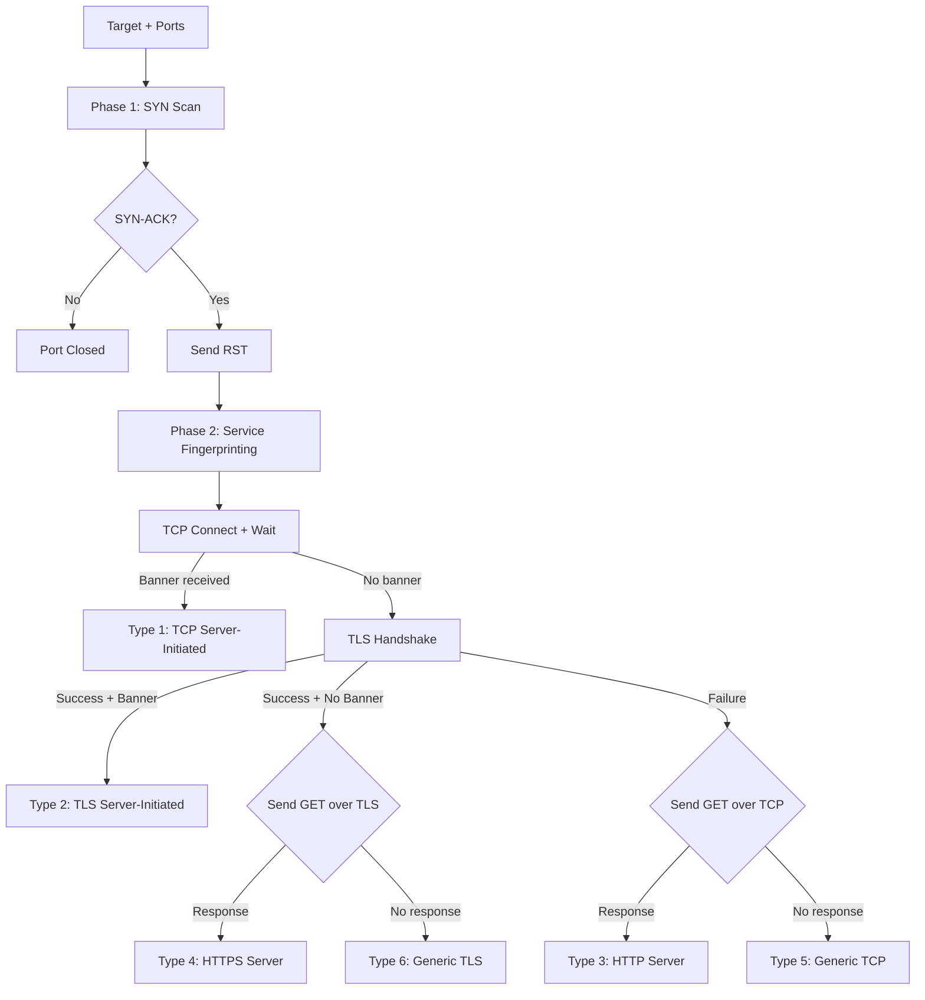

# tcpscan

> TCP SYN scanner with 6-type service fingerprinting


After building Argus for passive analysis, the natural next step was active reconnaissance. How does nmap actually fingerprint services? I built tcpscan to find out, and the probe ordering problem (distinguishing TLS from plain TCP when TLS servers are also TCP servers) turned out to be more interesting than I expected.

## What It Does

tcpscan performs a two-phase scan against a target host. Phase 1 sends raw TCP SYN packets to each specified port using Scapy and collects SYN-ACK responses to identify open ports. Phase 2 connects to each open port and runs a series of probes in a specific order to classify the service into one of six types, extracting the TLS certificate Common Name when applicable.

The scanner separates results from progress: scan output goes to stdout and progress messages go to stderr, so results can be piped or redirected cleanly.

## Architecture



## The Six Service Types

| Type | Name | Detection Method |
|------|------|-----------------|
| 1 | TCP server-initiated | Server sends a banner immediately after TCP connect (SSH, FTP, SMTP) |
| 2 | TLS server-initiated | Server sends data immediately after TLS handshake (IMAPS, POP3S) |
| 3 | HTTP server | Responds to `GET / HTTP/1.0` over plain TCP |
| 4 | HTTPS server | Responds to `GET / HTTP/1.0` over TLS |
| 5 | Generic TCP | Accepts TCP connection but does not respond to banner wait or GET probe |
| 6 | Generic TLS | Completes TLS handshake but does not respond to GET probe |

## Usage

tcpscan requires root privileges for raw SYN packet transmission.

**Scan default ports** (21, 22, 23, 25, 80, 110, 143, 443, 587, 853, 993, 3389, 8080):

```bash
sudo python3 tcpscan.py 192.168.1.1
```

**Scan specific ports:**

```bash
sudo python3 tcpscan.py -p 22,80,443 github.com
```

**Scan a range:**

```bash
sudo python3 tcpscan.py -p 1-1024 10.0.0.5
```

**Mixed specification:**

```bash
sudo python3 tcpscan.py -p 22,80-90,443,8080 target.example.org
```

## Example Output

```
Host: github.com:22
Type: (1) TCP server-initiated
Response: SSH-2.0-babeld-7de976b0

Host: google.com:443
Type: (4) HTTPS server | CN *.google.com
Response: HTTP/1.0 200 OK
Content-Type: text/html; charset=ISO-8859-1
...

Host: imap.gmail.com:993
Type: (2) TLS server-initiated | CN imap.gmail.com
Response: * OK Gimap ready for requests from ...
```

## How It Works

### Phase 1: SYN Scanning

The SYN scan sends a TCP packet with only the SYN flag set to each target port. If the port is open, the OS responds with SYN-ACK (flags `0x12`). tcpscan immediately sends a RST packet to tear down the half-open connection, avoiding a full three-way handshake. This is faster and less visible in logs than a full connect scan, since the connection never completes.

Scapy constructs and sends the raw packets directly, bypassing the kernel's TCP stack. The source port is auto-assigned, and the RST packet uses the sequence number from the SYN-ACK's acknowledgment field so the remote host accepts it.

### Phase 2: Why Probe Order Matters

The core challenge in service fingerprinting is that every TLS server is also a TCP server. If you send a plain TCP GET probe first, a TLS server will accept the TCP connection but return nothing meaningful (or close it). You have now consumed a connection attempt and learned nothing. Worse, you might classify port 443 as "Generic TCP" when it is actually HTTPS.

tcpscan solves this with a specific probe ordering:

1. **TCP connect and wait.** Connect over plain TCP and wait up to 2 seconds for a server-initiated banner. Services like SSH, FTP, and SMTP send their banner immediately after the TCP handshake completes, before the client sends anything. If data arrives, this is Type 1.

2. **TLS handshake.** Attempt a TLS connection with certificate validation disabled (since we are fingerprinting, not authenticating). If the handshake succeeds, we know the port speaks TLS. Wait for a server-initiated banner over the encrypted channel. If data arrives (like an IMAP greeting over TLS), this is Type 2.

3. **Branch based on TLS result.** This is the key decision point:
   - If TLS succeeded, all subsequent probes use TLS. Send `GET / HTTP/1.0\r\n\r\n` over a new TLS connection. If a response comes back, this is Type 4 (HTTPS). Otherwise, send a generic probe (`\r\n\r\n\r\n\r\n`) over TLS. Whatever happens, this is Type 6 (Generic TLS).
   - If TLS failed, the port only speaks plain TCP. Send the same GET probe over TCP. If a response comes back, this is Type 3 (HTTP). Otherwise, send the generic probe over TCP. This is Type 5 (Generic TCP).

The ordering guarantees that TLS services are never misclassified as plain TCP. The TLS probe runs before any client-initiated TCP probes, so by the time we try sending data over plain TCP, we already know TLS does not work on that port.

### Dual Certificate Extraction

tcpscan extracts the Common Name (CN) from TLS certificates using two methods. The primary method uses the `cryptography` library to parse the DER-encoded certificate and walk the subject attributes for the `COMMON_NAME` OID. If that library is not installed, a fallback parser scans the raw DER bytes for the CN OID sequence (`0x55 0x04 0x03`), reads the length byte, and decodes the string that follows. This means certificate extraction works even in minimal environments without the cryptography package.

### Response Sanitization

All service responses are sanitized before display. Non-printable bytes are replaced with `.`, matching the behavior of `tcpdump -A`. Printable ASCII (32-126) plus whitespace characters (tab, newline, carriage return) are preserved. Responses are capped at 1024 bytes.

## Testing

tcpscan includes two test harnesses.

**Fingerprint test** (no root required, tests the classification logic against live services):

```bash
python3 test_fingerprint.py
```

This script imports the fingerprinting functions from tcpscan without loading Scapy (patching out the scapy import), then probes real services to verify type classification:

| Target | Port | Expected Type |
|--------|------|--------------|
| github.com | 22 | Type 1 (SSH banner) |
| imap.gmail.com | 993 | Type 2 (IMAP over TLS) |
| example.org | 80 | Type 3 (HTTP server) |
| www.google.com | 443 | Type 4 (HTTPS server) |
| 127.0.0.1 | 9999 | Type 5 (Generic TCP, requires `nc -lkp 9999`) |
| 8.8.8.8 | 853 | Type 6 (DNS-over-TLS) |

**Full integration test** (requires root, runs SYN scan + fingerprinting on a Linux VM):

```bash
sudo bash run_tests.sh
```

This starts tcpdump, runs scans against multiple targets to exercise all six types, and captures the traffic to `test.pcap` for offline analysis.

## Requirements

- Python 3.8+
- [Scapy](https://scapy.net/) (raw packet construction and SYN scanning)
- [cryptography](https://cryptography.io/) (optional, certificate CN extraction)
- Root/sudo privileges (required for raw socket SYN scanning)

```bash
pip install scapy cryptography
```

## Related Projects

Part of a 5-project security research portfolio: [Secure Vault](https://github.com/FardinIqbal/secure-vault) (password manager), [NetSec Toolkit](https://github.com/FardinIqbal/netsec-toolkit) (certificate analyzer), [Argus](https://github.com/FardinIqbal/argus) (passive network sniffer), [x86 Exploit Lab](https://github.com/FardinIqbal/x86-exploit-lab) (buffer overflow research).
