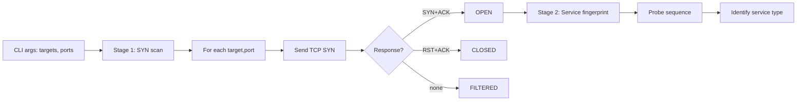

# Architecture

Deep reference for tcpscan. The README covers what the tool does and the probe-ordering insight; this doc covers the implementation structure, fingerprinting strategy, and edge cases.

## Two-stage scan



Stage 1 (SYN scan) determines port openness. Stage 2 (service fingerprint) identifies what is running on each open port.

## Service fingerprinting

The fingerprinter sends a series of probes in a deliberate order. Each probe is designed to elicit a distinctive response from one type of service:

| Order | Probe | Identifies |
|-------|-------|------------|
| 1 | TLS ClientHello | TLS-wrapped services (HTTPS, IMAPS, etc.) |
| 2 | HTTP `GET / HTTP/1.0\r\n\r\n` | HTTP servers |
| 3 | Empty + read banner | SMTP, FTP, POP3, IRC, SSH (banner-based) |
| 4 | DNS query packet | DNS servers (UDP-style probe over TCP) |
| 5 | EHLO probe | SMTP servers |
| 6 | Generic null | Catchall |

The order matters because some services respond to multiple probes. A TLS service will respond to a TLS ClientHello (probe 1) and ALSO drop the connection on an HTTP probe (probe 2). If we sent the HTTP probe first, we would mark the service as "not HTTP" but never realize it was TLS.

Sending TLS first is the key insight. TLS-wrapped services return a structured TLS ServerHello, which is unmistakable. After ruling out TLS, the remaining probes can run in order without ambiguity.

## Probe responses

Each probe captures up to 1024 bytes of response and runs through a list of pattern matchers:

```python
PATTERNS = [
    (b"\x16\x03", "TLS"),                         # TLS handshake
    (b"HTTP/1.", "HTTP"),                          # HTTP response
    (b"220 ", "SMTP"),                             # SMTP banner
    (b"+OK", "POP3"),                              # POP3 banner
    (b"* OK", "IMAP"),                             # IMAP banner
    (b"SSH-", "SSH"),                              # SSH banner
    (b"220 ", "FTP"),                              # FTP banner (overlaps SMTP)
    (b"NOTICE ", "IRC"),                           # IRC server notice
]
```

When a pattern matches, the service is identified. If no pattern matches, the response is reported as "Unknown" with the raw bytes for inspection.

## Concurrency

The scanner uses Python's `concurrent.futures.ThreadPoolExecutor` to run probes in parallel. Each `(target, port)` pair gets its own thread; the pool size is configurable.

The benefit is large: scanning 100 ports sequentially with a 2-second timeout per probe is 200 seconds. With a 50-thread pool, the same scan completes in ~4 seconds.

The cost is negligible: each thread holds one socket and a small amount of buffer memory.

## Timeout handling

Probes have two timeouts:

1. **Connect timeout** (2 seconds default): how long to wait for the SYN+ACK or RST+ACK.
2. **Read timeout** (1 second default): how long to wait for response bytes after sending a probe.

A connect timeout means the port is filtered (firewall dropping). A read timeout means the service is open but does not respond to this probe (try the next one).

## Output format

```
target:port  STATUS  SERVICE  detail
example.com:443  OPEN  TLS  google.com (cert)
example.com:80   OPEN  HTTP  Apache/2.4.41
example.com:22   OPEN  SSH   SSH-2.0-OpenSSH_8.2p1
example.com:25   FILTERED  -  -
example.com:23   CLOSED  -  -
```

Tab-separated where possible. Easy to grep, parse, or pipe.

## Testing

The test suite (`test_fingerprint.py`) covers:

- Each probe response pattern with a synthetic byte stream
- Probe ordering: TLS-first vs HTTP-first
- Timeout handling (connect vs read)
- Edge cases: empty response, mid-probe disconnect, malformed banner

Run with `python3 -m pytest test_fingerprint.py`.
